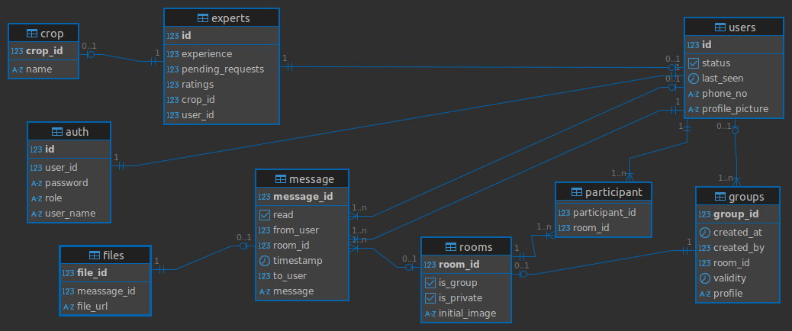

# ☕ Spring Boot Backend Repository

This repository contains two core modules:

1. **Boilerplate** – A reusable Spring Boot base with enterprise-ready features.
2. **Project** – The backend for **KM Agri**, an intelligent platform for farmers (the jpa branch has the main logic).

---

## 📁 Folder Structure

```text
├── boilerplate
│   └── (Reusable Spring Boot starter code)
├── project
│   └── (Spring Boot backend for KM Agri)
```

---

## 🔧 1. Boilerplate

The `boilerplate` folder includes a generic Spring Boot setup with powerful features to kickstart development quickly.

### ✅ Features

- 🔐 JWT Authentication & Authorization
- ⚙️ CRUD using **JPA** and **MyBatis**
- 🌐 Async HTTP Calls (using `WebClient`)
- 📊 Spring Boot Actuator for monitoring
- 🌍 Localization (i18n)
- 🧪 Global Exception Handling
- 🧱 Modular layered architecture

---

## 🌱 2. Project - KM Agri Backend

The **KM Agri** backend provides intelligent services for farmers to get expert guidance and AI-powered insights (the jpa branch has the main logic).

### 🧩 Key Features

- ✅ **Lazy Loading**: Implemented for data fetching to improve performance and reduce memory overhead.
- 🧵 **Kafka Integration**: Used for asynchronous processing, boosting **database throughput** under high load.
- ⚡ **Redis Caching**: Integrated Redis for caching frequently accessed data and minimizing DB hits.
- 🧠 **Microservice-based AI Model Call**: Separated microservice architecture to call AI models externally.
- 👥 Role-based secure APIs with stateless aproach using jwt 
- 🧵 Websocket for chatting  
- 📄 RESTful endpoints with proper DTOs


## 🌿 JPA Branch

The repository has a dedicated branch named **`jpa`** that contains a clean implementation using only **Spring Data JPA**, without MyBatis.
It also have **JPA** implementation of **PizzaPalace**
[Link Text](https://github.com/Bharatkhalate2121/srpingboot-react)

### To switch to the JPA-only implementation:

```bash
git checkout jpa
```

### ⚙️ Tech Stack

- Spring Boot
- Spring Security + JWT
- Kafka (Apache Kafka)
- Redis
- Postgres
- JPA + Hibernate
- Maven
- Microservices (AI model service via HTTP)
- Docker 

## 🗄️ Database Schema



---

## 🚀 Running the Projects

> Prerequisites: Java 17+, Maven, MySQL, Redis, Kafka


# Navigate to desired module
cd boilerplate    # or cd project

# Run the project
mvn spring-boot:run

Make sure Redis and Kafka services are running before launching the KM Agri backend.
AI microservice must be accessible on the configured host/port.

### 🛡 Security
-JWT-based login & role management
-Secured endpoints based on user roles (Admin, Expert, Farmer)

### 📄 License
-This project is licensed under the MIT License.
